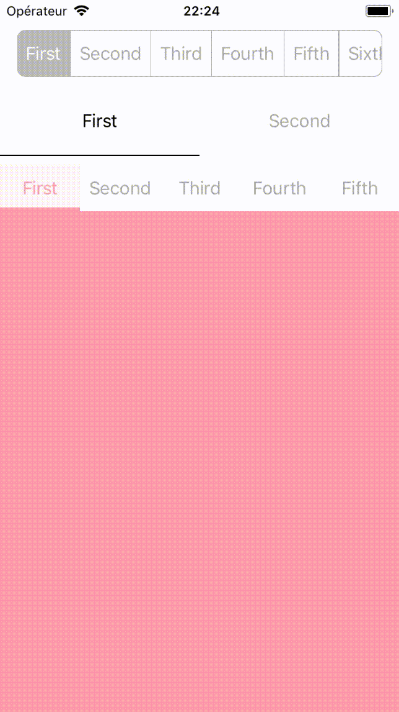

# MXSegmentedControl

[](https://travis-ci.org/maxep/MXSegmentedControl)
[](http://cocoadocs.org/docsets/MXSegmentedControl)
[](https://github.com/Carthage/Carthage)
[](http://cocoadocs.org/docsets/MXSegmentedControl)
[](http://cocoadocs.org/docsets/MXSegmentedControl)

Yet another segmented control for iOS inspired by [Segmentio](https://github.com/Yalantis/Segmentio) & [HMSegmentedPager](https://github.com/HeshamMegid/HMSegmentedControl).
MXSegmentedControl is easy to integrate and very customizable. It dynamically computes the segments width to fit or fill its content, it can also track a UIScrollView content offset to change segment.

<p align="center">

</p>

## Installation

MXSegmentedControl is available through [CocoaPods](https://cocoapods.org/pods/MXSegmentedControl). To install
it, simply add the following line to your Podfile:

```
pod 'MXSegmentedControl'
```

## Usage

+ You can configure a simple segmented control like following:

```swift
segmentedControl.append(title: "First")
segmentedControl.append(title: "Second")
segmentedControl.append(title: "Third")
```
                                               
## Author

[Maxime Epain](http://maxep.me)
                                               
## License
                                               
MXSegmentedControl is available under the MIT license. See the [LICENSE](LICENSE) file for more info.
